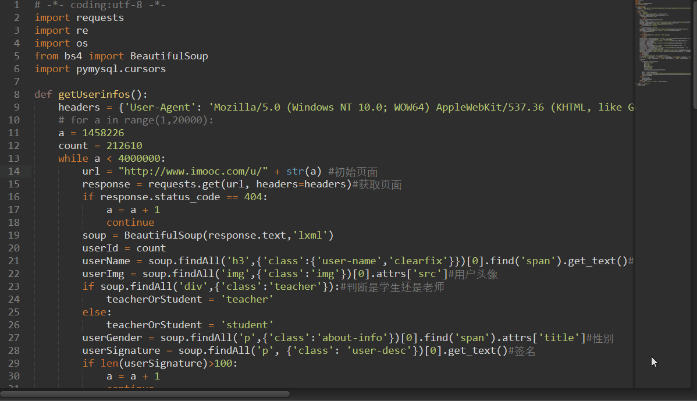
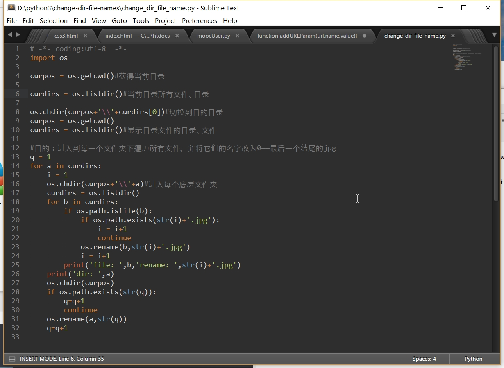

# Hobbies
hobbies about mysql,python,php,linux,google extension,shadowsocks

##1. python crawler (crawl the information in imooc.com)

通过requests,BeautifulSoup,pymysql.cursors库用一个循环完成对慕课网用户信息的采集

###主脚本

###数据库收集到的信息

###写入到本地文件

##2.一个python批量修改文件的脚本

指定目录下所有文件重命名

##3.google extension

##4.php系列

##5.linux系列
